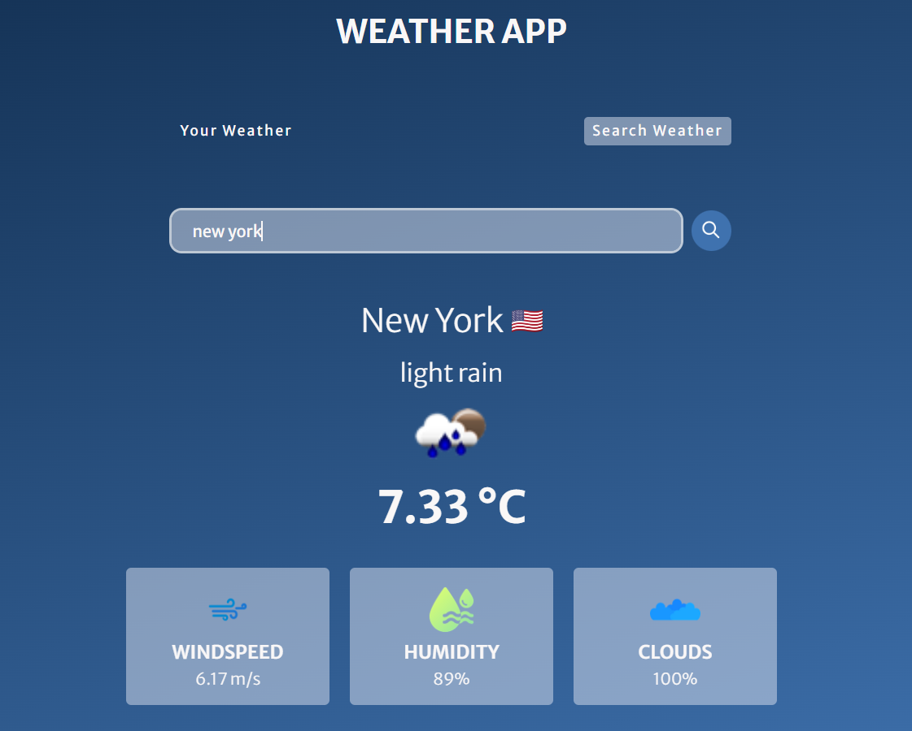

# Weather App



## Overview

Weather App is a web application that allows users to check weather information based on their location or search for the weather in a specific city. The app provides real-time weather details, including temperature, wind speed, humidity, and cloud cover.

## Features

- **User Location:** Automatically fetches weather information based on the user's location.
- **Search Weather:** Allows users to search for weather information in a specific city.
- **Responsive Design:** Ensures a seamless experience across various devices.

## Demo

You can view a live demo of the Weather App [https://quiet-belekoy-f94fbb.netlify.app/](#).

## How to Use

1. Click on the "Your Weather" tab to get weather information based on your current location.
2. Grant location access if prompted.
3. Alternatively, click on the "Search Weather" tab and enter the desired city to get weather information.
4. Explore the details about temperature, wind speed, humidity, and cloud cover.

## Technologies Used

- HTML
- CSS
- JavaScript

## Installation

1. Clone the repository:

   ```bash
   git clone https://github.com/your-username/weather-app.git
   ```

2. Open the `index.html` file in your preferred web browser.


## Credits

- Weather data provided by [OpenWeatherMap](https://openweathermap.org/).
- Icons made by [Freepik](https://www.freepik.com) from [www.flaticon.com](https://www.flaticon.com/).

## License

This project is licensed under the MIT License - see the [LICENSE](LICENSE) file for details.
